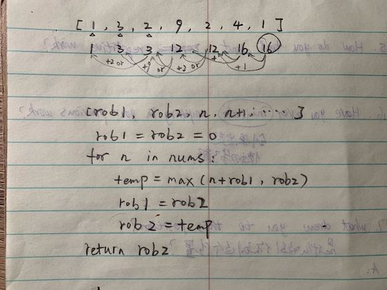

## 198. House Robber (Medium 10669 233)

Solution: https://www.youtube.com/watch?v=73r3KWiEvyk&t=163s

You are a professional robber planning to rob houses along a street. Each house has a certain amount of money stashed, the only constraint stopping you from robbing each of them is that adjacent houses have security systems connected and it will automatically contact the police if two adjacent houses were broken into on the same night.

Given an integer array nums representing the amount of money of each house, return the maximum amount of money you can rob tonight without alerting the police.

Example 1:

Input: nums = [1,2,3,1]

Output: 4
Explanation: Rob house 1 (money = 1) and then rob house 3 (money = 3).
Total amount you can rob = 1 + 3 = 4.

Example 2:

Input: nums = [2,7,9,3,1]

Output: 12
Explanation: Rob house 1 (money = 2), rob house 3 (money = 9) and rob house 5 (money = 1).
Total amount you can rob = 2 + 9 + 1 = 12.

Constraints:

1 <= nums.length <= 100

0 <= nums[i] <= 400
